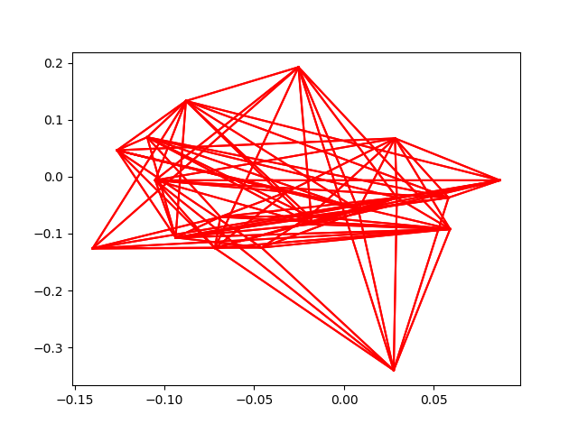
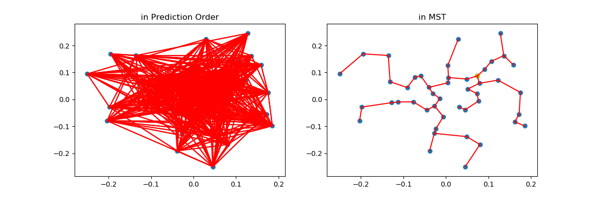

# MolGAN
Pytorch implementation of MolGAN: An implicit generative model for small molecular graphs (https://arxiv.org/abs/1805.11973)  
This library refers to the following two source code.
* [nicola-decao/MolGAN](https://github.com/nicola-decao/MolGAN)
* [yunjey/StarGAN](https://github.com/yunjey/StarGAN)

## RUN

data generation:  
```
python generateDataset.py  

python dataGAN/sparse_molecular_dataset.py
```

train:  
```
python main.py
```  

test:  
```  
python evaluationGAN.py   
Change iteration: solver = testCaseGenerator(iteration)  
Cal KL-distance: calDistance()  
Compare iteration: compareIteration()  
Cal average EdgeNum: calEdgeNum(170000)  
```  

## Experiment  

### Original MolGAN (without reward)  

#### Data preprocess  

- Area: andes_peru, [-9.0874, -77.5737]  
- Radius: 90 km  
- Size of each tree: 20 - 100 peaks
- Number of trees: 626

**Normalization**  
- latitude and longitude normalization:
  - map to [0, 1] for each tree
- elevation and prominence normalization:
  - map to [0, 1] for the whole 626 trees dataset, $newx = \frac{x - xmin}{xmax - xmin}$, in feet:
    - elevation min: 570 
    - elevation max: 22099 
    - prominence min: 101 
    - prominence max: 9065 

#### Training  

config:  
(TODO: a global config controller)  
- g_conv_dim = [128, 256, 512]  
- d_conv_dim = [[100, 64], 100, [100, 64]]  
- batch_size = 2  
- num_iters = 200000  

Training time: 1.5 hours  

#### Result  
##### original result 
after 100000 iterations:  
   

MST sample:  
46 nodes
  

Evaluation: 
- using pretrained model to generate 100 samples (fixed size: 100)
- for each sample：
  - retireve 20 real data(20-100 long) from datasets
  - let sample size = real data size, sample[:size]
  - compute tree edit distance, compute KL-divergency

tree edit distance:     
- 20 (which means no nodes same, remove&insert penalty = 20)  

KL-divergency(elevation, prominence): 
- average: 0.44337702, 0.29986525 
- min: 0.14103942  0.08884087 

Compare to other methods:  


## TODO  

1. Reward machine:  
- Connectivity score: 1 / number of strong connected subgraphs  
- Redundancy score: 1 - |(all edges - MST edges) / all edges|

  no difference...

2. Structure:  
- generator's structure:  
    - edge: 32->256->512->1024->20000(100x100x2)  unreasonable
    - node: 32->256->512->1024->400(100x100x4)  


predictLen, tree edit distance, elevation kl distance, prominence kl distance

Add layer:  [4096], I think we need a bigger one but gpu memory exceeds
- 10000:  
[53.35294118 20.          0.43599603  0.32547648]  
[25.         20.          0.13002367  0.10417727]

Postprocess bug:  hard->soft: A BUG
- 50000:  
[53.35294118 20.          0.44846591  0.26389311]  
[25.         20.          0.13553155  0.09384721]

delete the postprocess of nodes, not a probability distribution:  
- 4000:  
[53.35294118 20.          0.47656859  0.2633292 ]  
[25.         20.          0.17187368  0.06288236]


