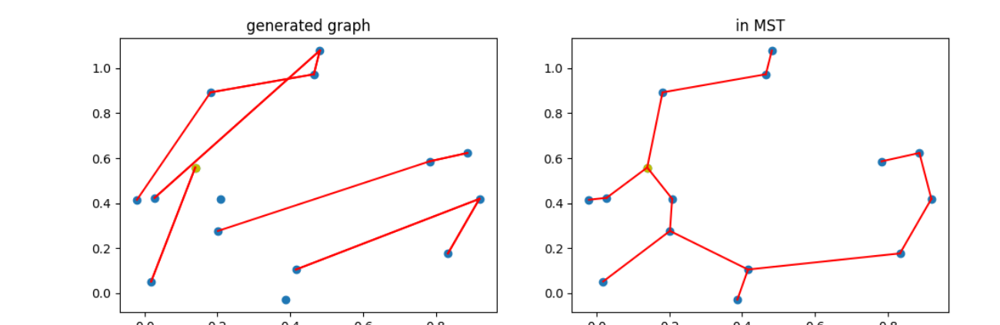
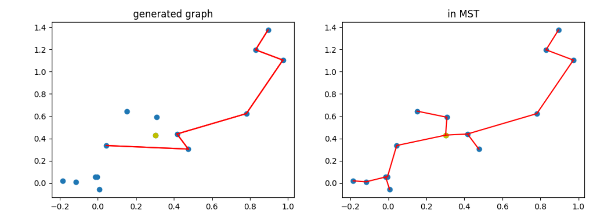
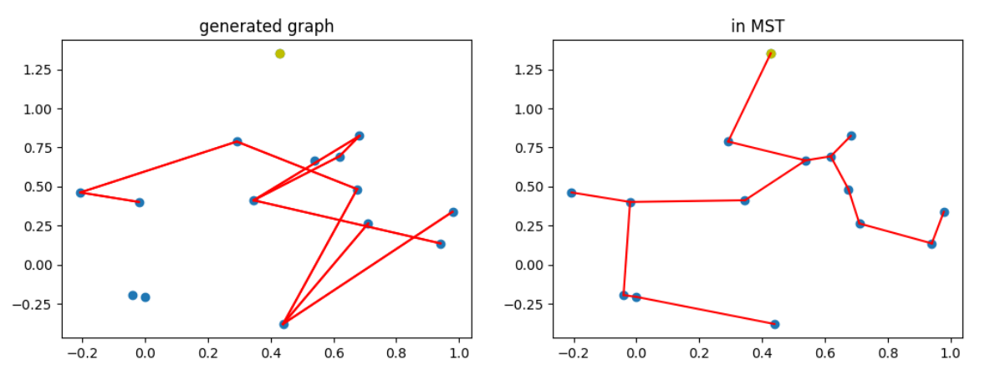
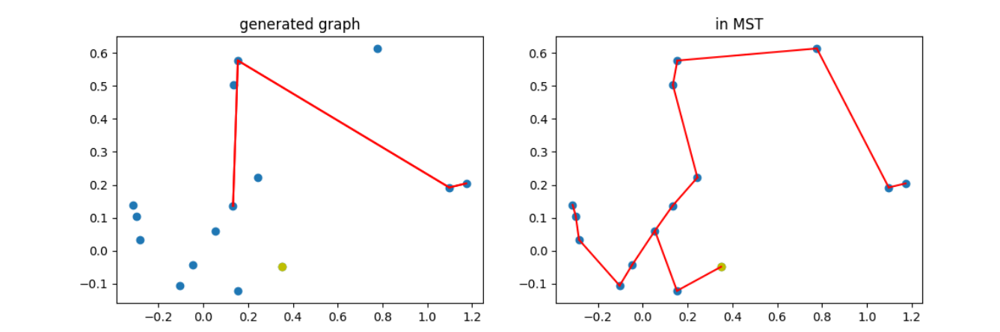
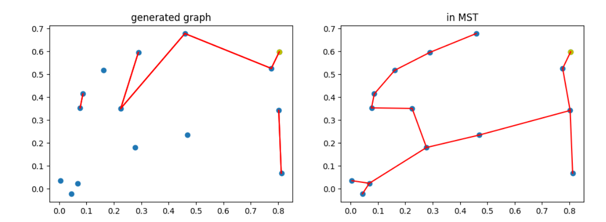
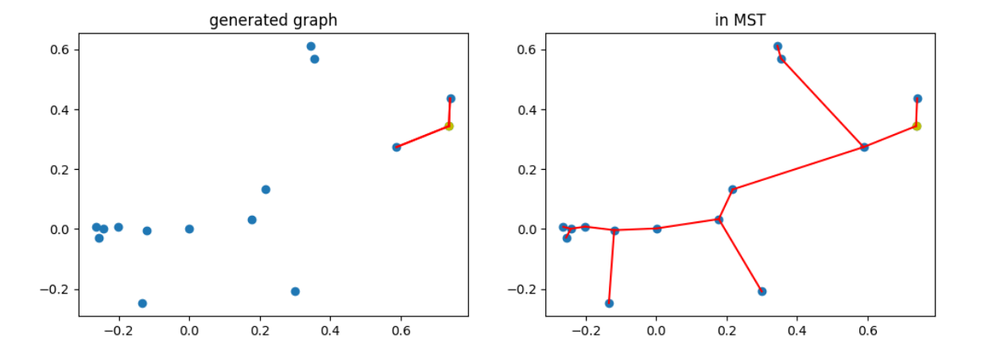
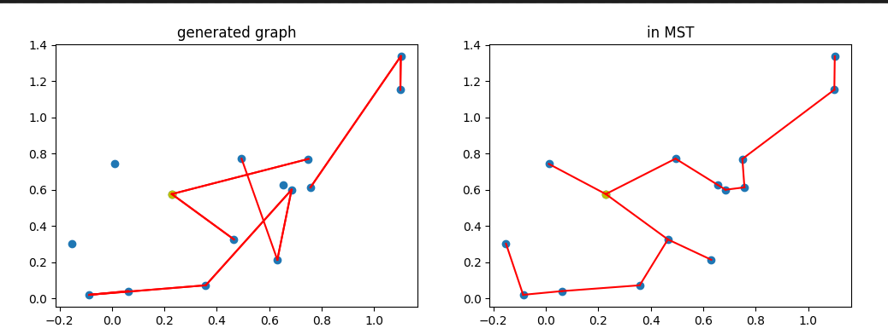
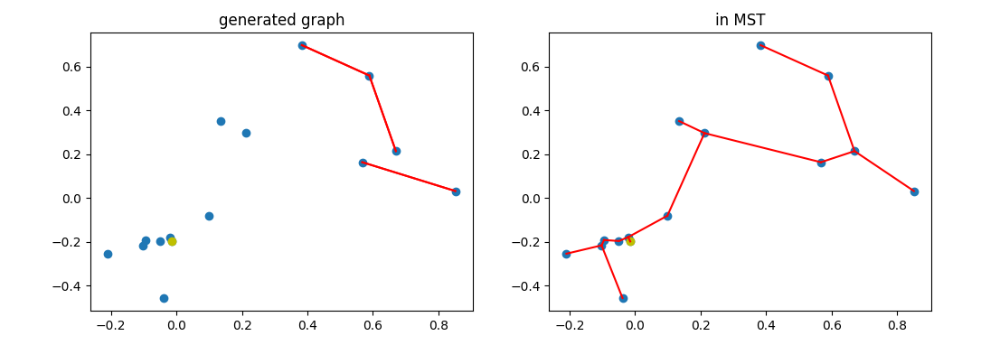
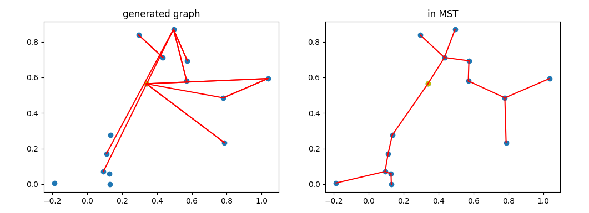
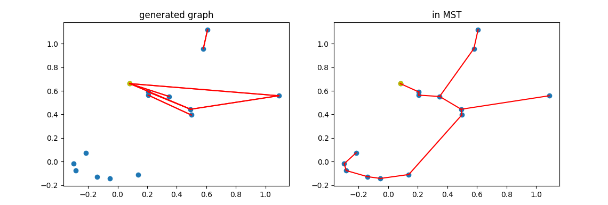

## 0.5 0.5 discrete

train: 0.5 x tree Reward(0 or 1) + 0.5 x connectivity Reward(0 or 1)

evaluation: 1-abs((size-(v-1)) / (v-1)), 1/Part Number

best iteration: 20000

average reward: 0.19

## 0.5 0.5 continuous

train: 0.5 x tree Reward(continuous) + 0.5 x connectivity Reward(continuous)

evaluation: 1-abs((size-(v-1)) / (v-1)), 1/Part Number

best iteration: 120000

average reward: 0.28

## 0.7 0.3 discrete

train: 0.7 x tree Reward(0 or 1) + 0.3 x connectivity Reward(0 or 1)

evaluation: 1-abs((size-(v-1)) / (v-1)), 1/Part Number

best iteration: 60000

average reward: 0.20

## 0.7 0.3 continuousquarantine

train: 0.7 x tree Reward(continuous) + 0.3 x connectivity Reward(continuous)

evaluation: 1-abs((size-(v-1)) / (v-1)), 1/Part Number

best iteration: 20000

average reward: 0.09

## 0.3 0.7 discrete

train: 0.3 x tree Reward(0 or 1) + 0.7 x connectivity Reward(0 or 1)

evaluation: 1-abs((size-(v-1)) / (v-1)), 1/Part Number

best iteration: 120000

average reward: 0.27

