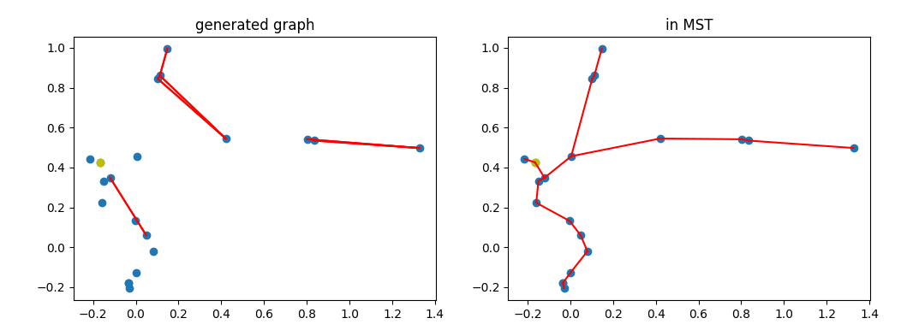
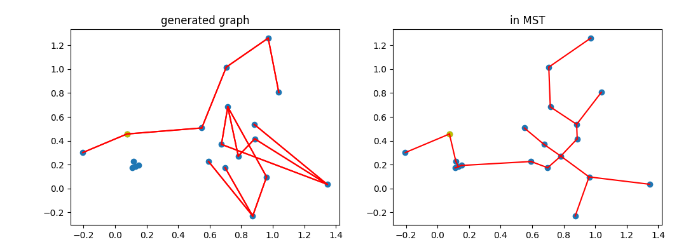
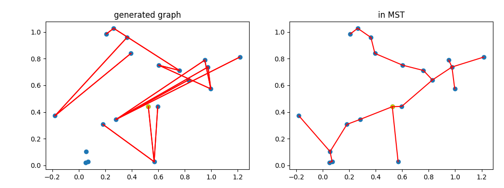
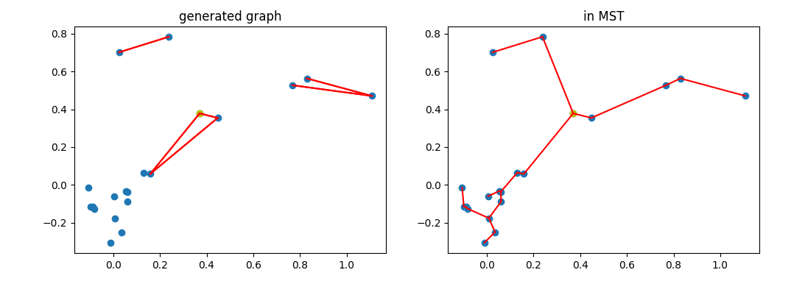

## 0.8 0.2 continuous

train: 0.8 x tree Reward + 0.2 x connectivity Reward

evaluation:

- tree Reward:  $1 - (\frac{edgeNUM - (v-1)}{max(edgeNUM, v-1)})^2$
- connectivity Reward: $(\frac{1}{subgraph \space  number})^{\frac{1}{2}}$

best iteration: 70000

average reward: 0.62

average edge number: 10.38

## 0.7 0.3 continuous

train: 0.7 x tree Reward + 0.3 x connectivity Reward

evaluation:

- tree Reward:  $1 - (\frac{edgeNUM - (v-1)}{max(edgeNUM, v-1)})^2$
- connectivity Reward: $(\frac{1}{subgraph \space  number})^{\frac{1}{2}}$

best iteration: 70000

average reward: 0.68

average edge number: 12.34

