## 0.8 0.2 continuous

train: 0.8 x tree Reward + 0.2 x connectivity Reward

evaluation:

- tree Reward:  $1 - (\frac{edgeNUM - (v-1)}{max(edgeNUM, v-1)})^2$
- connectivity Reward: $(\frac{1}{subgraph \space  number})^{\frac{1}{2}}$

best iteration: 70000

average reward: 0.62

average edge number: 10.38

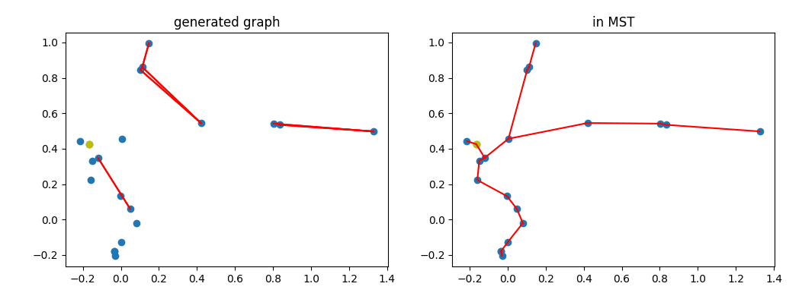

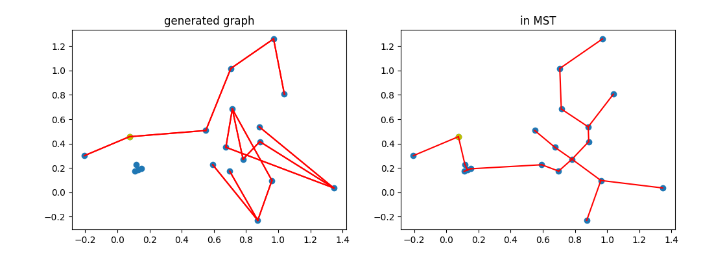

## 0.7 0.3 continuous

train: 0.7 x tree Reward + 0.3 x connectivity Reward

evaluation:

- tree Reward:  $1 - (\frac{edgeNUM - (v-1)}{max(edgeNUM, v-1)})^2$
- connectivity Reward: $(\frac{1}{subgraph \space  number})^{\frac{1}{2}}$

best iteration: 70000

average reward: 0.68

average edge number: 12.34

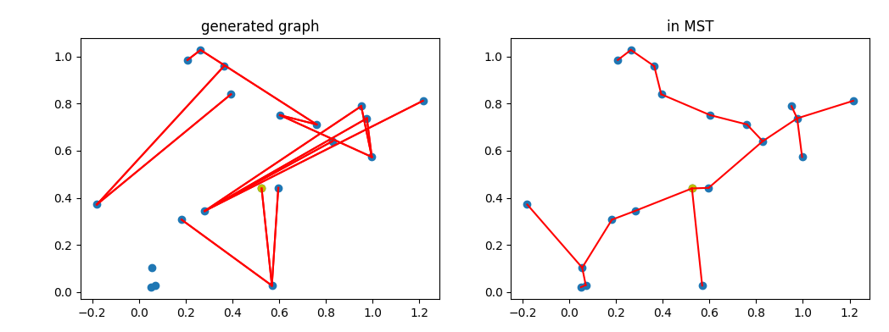

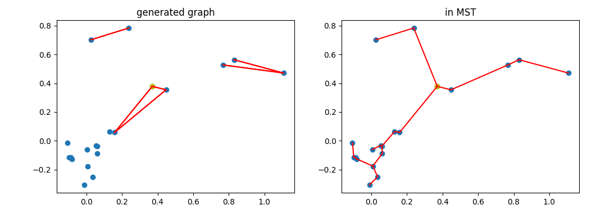

## 0.7 0.3 continuous

train: 0.7 x tree Reward + 0.3 x connectivity Reward

evaluation:

- tree Reward:  $1 - (\frac{edgeNUM - (v-1)}{edgeNUM})^2$
- connectivity Reward: $(\frac{1}{subgraph \space  number})^{\frac{1}{2}}$

best iteration: 190000

average reward: 0.14

average edge number: 13.36

avg:  [17.5	20. 	0.087  0.130  0.079  0.145]
min:  [16 	20 	0.047 	0.031 	0.012 	0.038]

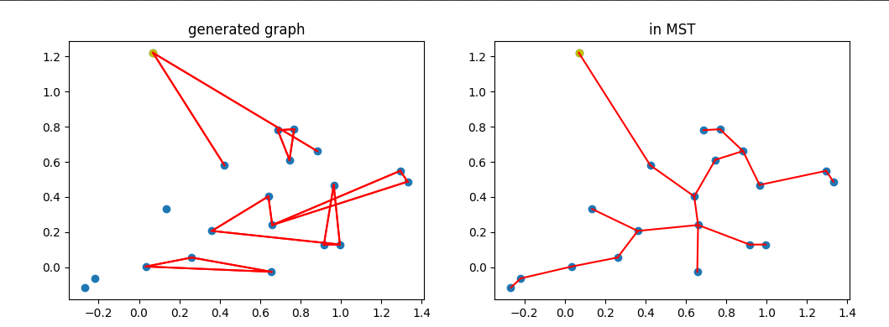

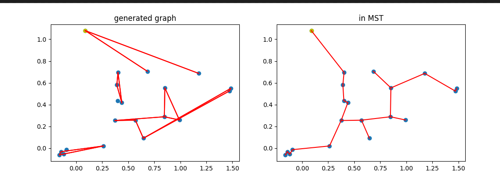

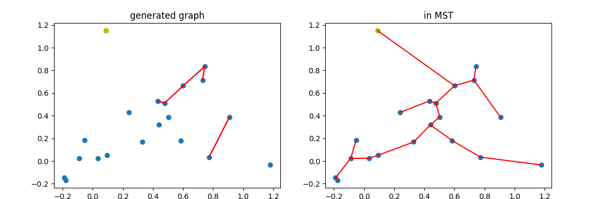

## 0.7 0.3 continuous

train: tree Reward * connectivity Reward

evaluation:

- tree Reward:  $1 - (\frac{edgeNUM - (v-1)}{edgeNUM})^2$
- connectivity Reward: $(\frac{1}{subgraph \space  number})^{\frac{1}{2}}$

best iteration: 130000

average reward: 0.184

average edge number: 12.85

avg:  [17.5	20. 	0.087  0.130  0.079  0.145]
min:  [16 	20 	0.047 	0.031 	0.012 	0.038]

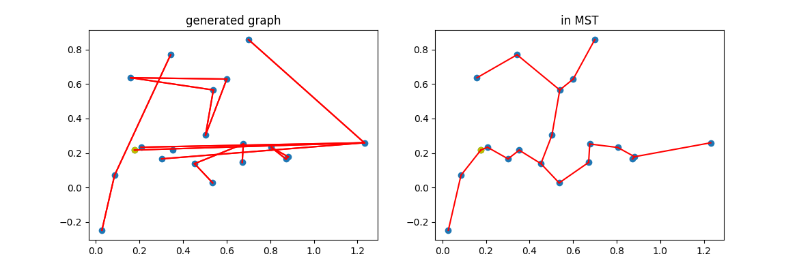

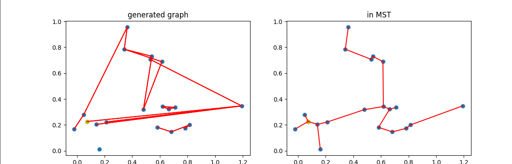

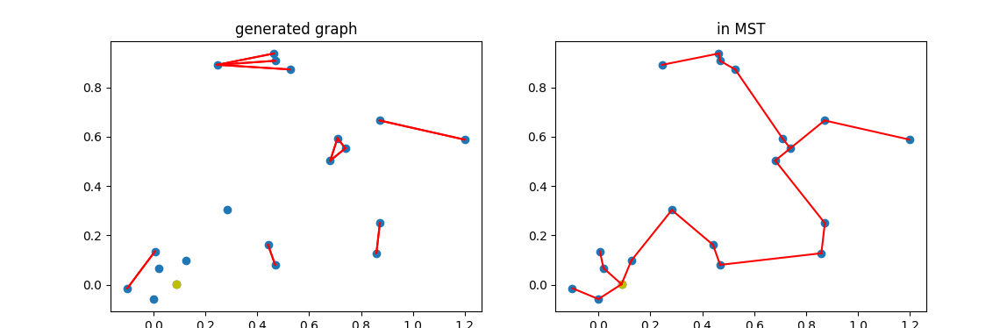

avg:  [17.5        20.          0.090  	0.091  	0.0802  	0.178]
min:  [1.60  	20 	0.035 	0.015  	0.012 	0.086]

## 0.5 0.5 continuous

train: 0.5 x tree Reward + 0.5 x connectivity Reward

evaluation:

- tree Reward:  $1 - (\frac{edgeNUM - (v-1)}{edgeNUM})^2$
- connectivity Reward: $(\frac{1}{subgraph \space  number})^{\frac{1}{2}}$

best iteration: 30000

Avg rewards:  0.70

average edge number: 16.44

avg:  [17.5        20.          0.0976  0.116  0.07615  0.1613]
min:  [16.         20.          0.0394  0.04741  0.0209   0.0949]

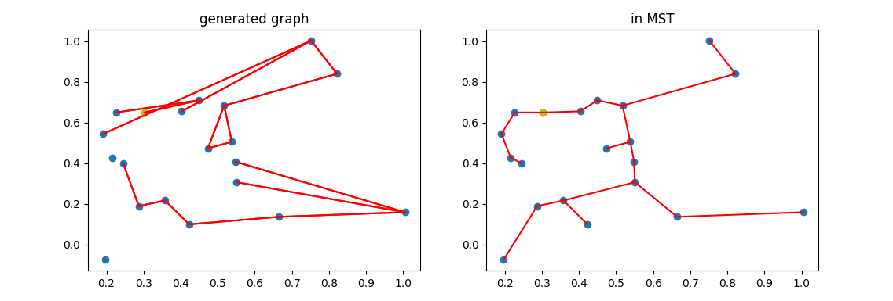

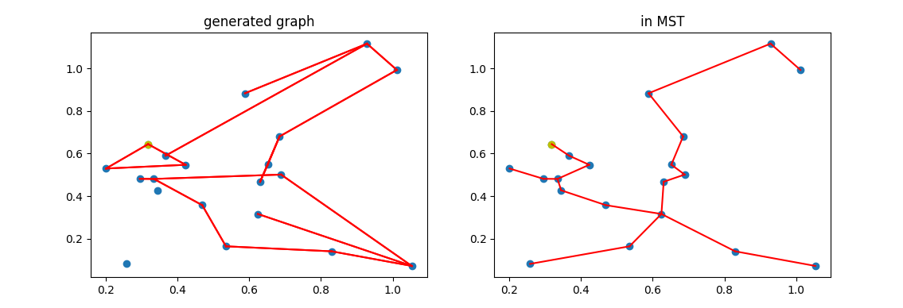

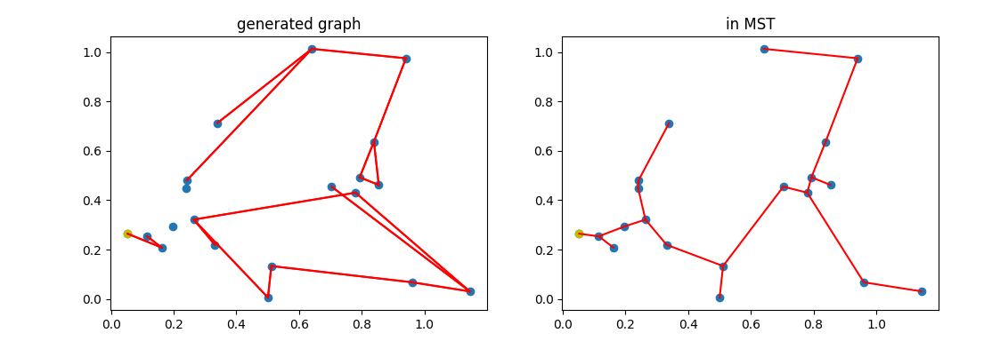

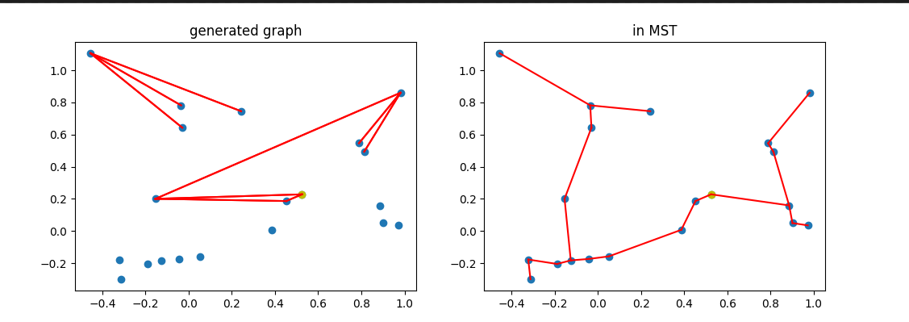