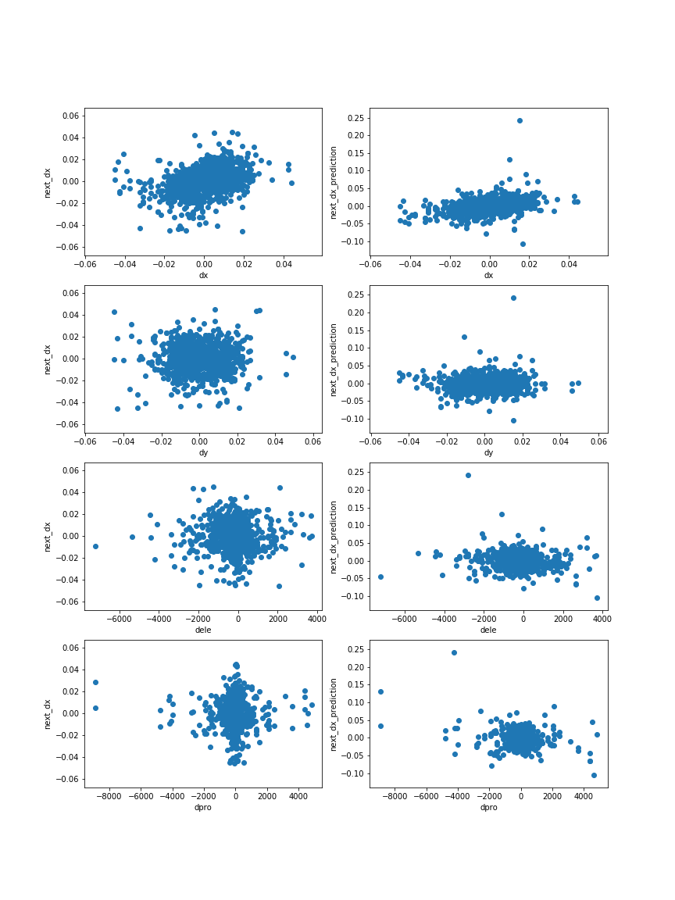
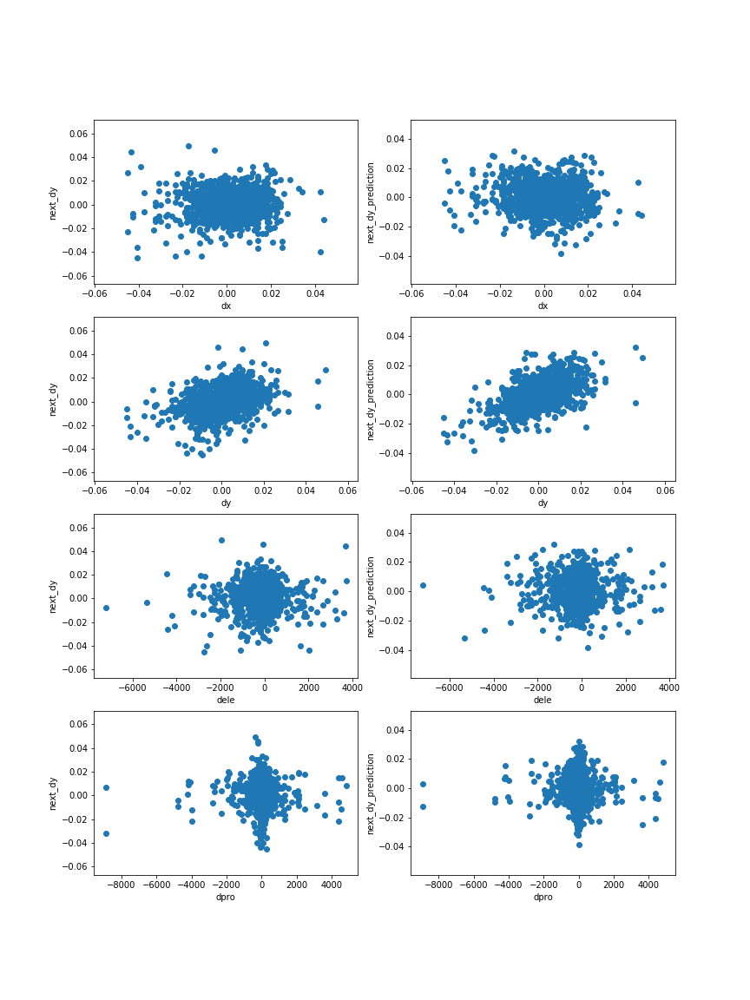
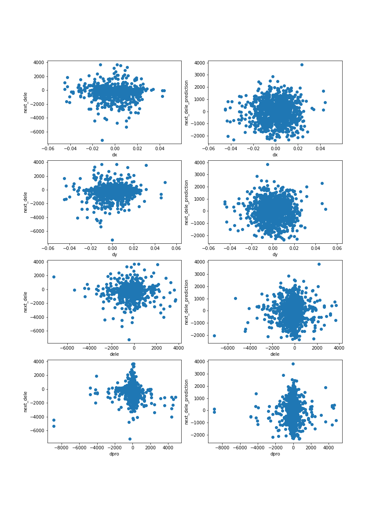
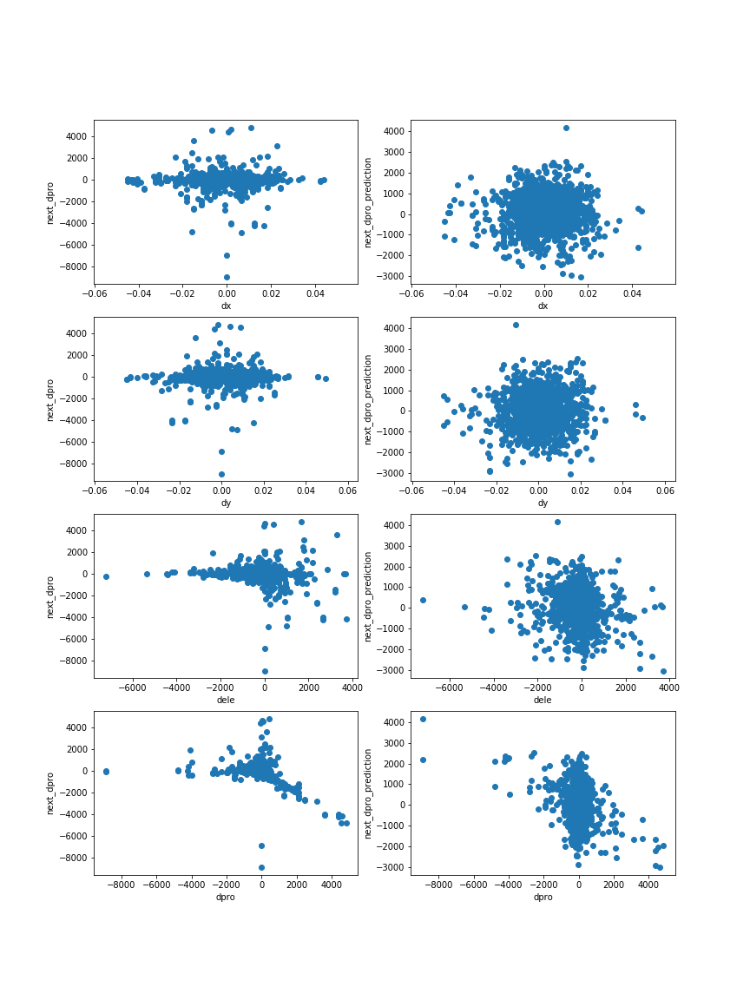
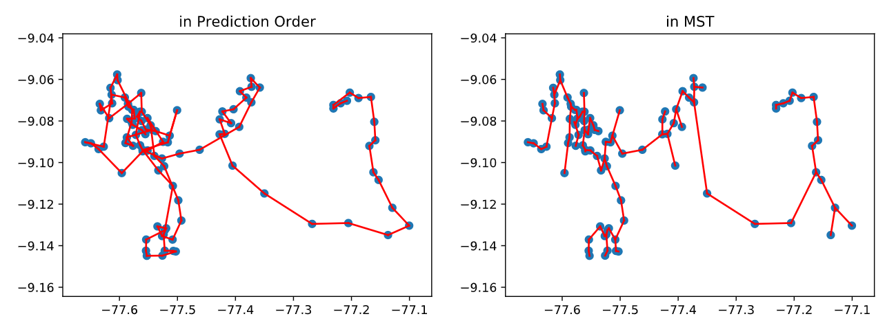
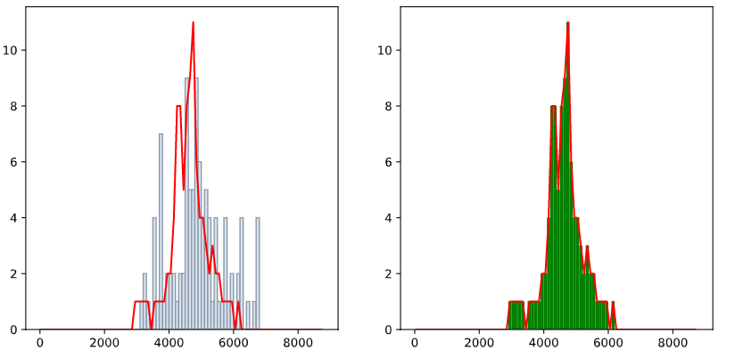
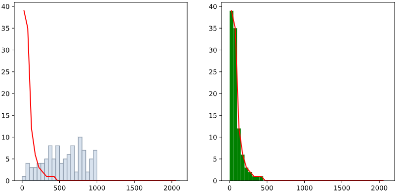

## Automatically Terrain Divide Tree Generation 

Wang KAI, 2020/2/29

### Problem

We know divide tree's function in terrain generation area from Oscar's work. One biggest shortcoming of his method is high time cost. About 60 seconds for 1000 peaks generation. 

What I want to do is using sequence prediction method to solve the divide tree generation problem. And I have implemented two primary versions using RNN and MC.


### Data

###### [alliso-sorted.txt][https://github.com/akirmse/mountains]:

The isolation file has one peak per line, in this format:	

latitude,longitude,elevation in feet,ILP latitude,ILP longitude,isolation in km

###### [prominence-p100.txt][https://github.com/akirmse/mountains]

The prominence file has one peak per line, in this format:

latitude,longitude,elevation in feet,key saddle latitude,key saddle longitude,prominence in feet


For faster processing and training, I only used `andes_peru`  area for training the model currently.  


### RNN Model

Using a 8 long subsequence of the divide tree's sequence representation to predict the next peak.

#### Data preprocessing

1. Sample disk-like areas from the whole region area. Disk radius is 20 km.

   1. For each disk-like area sample, collect all peaks out and then build the tree structure. 

      ```
      rootNode = genDivideTree(peaks)
      -- construct a adjacent table contains distances between each pair of peaks
      -- using minimum spanning tree algorithm to build the tree, store them in a tree structure
      ```

   2. Using DFS algorithm to generate the sequence representations of the tree. 

      ```
      seqOfTree = genFullSeq(rootNode, isDFS=True)
      ```

   3. There are three types of node in the sequence:

      1. left parenthesis, value=[-1, 0, 0, 0, 0]

      2. peak, value[0, delta x, delta y, delta elevation, delta prominence]

         For example, 

         there is a sequence representation [ A [ B ] ], B = [0, x_b - x_a, y_b - y_a, ele_b - ele_a, pro_b - pro_a]

2. Then we get a sequence dataset, each sequence represent one sampled area

3. data standardization: using z-score method

   $\mu$  and $\sigma$ are the mean and variance over all peaks

4. training sample generation, call function `random_training_set(chunk_len, batch_size)`. Randomly choose a sequence, and then randomly choose a 9 long subsequence from it. First 8 as input, and the last one is what i want to predict.


###### **why I use MST instead of real divide tree for training data generation?**

According to Oscar's paper, 5.2 section:

```
In the second step, we introduce ridge lines that connect pairs of nearby peaks. We note that Divide Trees sourced from real terrains resemble sub-graphs of a Delaunay  riangulation, since peaks (ver- tices) are usually connected based on proximity by ridges (edges) that do not intersect. Our analysis of several Divide Trees confirmed this hypothesis: more than 95% of the peak to peak connections – omitting the intermediate saddle – in T are edges in the corre- sponding Delaunay triangulation of the peak positions. Further- more, previous work in geology showed that the topology of a ridge.

network often minimizes the total ridge length in fluvial-eroded landscapes [Mark 1981]. Hence, we compute the triangulation of the peak positions and derive a Divide Tree T as the minimum spanning tree (MST) of this triangulation, with the following edge weights: 
```

$$\omega_{ij} = \frac{||P_i - P_j||}{min(h(P_i ), h(P_j ))^{\rho}}​$$

```
This weight is proportional to the distance between peaks, inversely proportional to the lowest of the two peaks in the ridge, and the exponent ρ controls the balance between short (low ρ) and elevated (high ρ) ridges. This control allows us to deviate from the distance-based MST of the peaks (ρ = 0) and capture different types of landscapes. In practice, based on empirical observation (see supplementary material for more detail), we set ρ = 0, 1, or 2.
```

And in my data generation, I set ρ = 0, so that the weight of two peaks' connection is their euclidean distance.

#### Model

A classic RNN model in Pytorch

Input: batch of training data. Each has 5 dimensions as mentioned.

output: 7 dimensions, 1-3 for classification, 4-7 for prediction.

Hidden size: 256

Layer num: 2 

input layer: full connection, 5*256

output layer: full connection, 256*7

loss function: 

```python
loss1 = torch.nn.functional.cross_entropy(output.view(args.batch_size, -1)[:, :3], tagTarget[:,c].squeeze())

loss2 = weighted_mse_loss(output.view(args.batch_size, -1)[:, 3:], target[:,c].squeeze(), weights[1:])

loss = loss1 + loss2
```

optimizer: The learning rate is reduced by 10 times every 500 epochs

```python
torch.optim.SGD(decoder.parameters(), lr=args.learning_rate,  momentum=0.9)
```

#### Generation

1. choose randomly the beginning 8 node in the sequences dataset.

2. input them one by one to build up the hidden vector.

3. using the hidden vector from the seventh run and the eighth input to predict the next one.

   ```python
   for p in range(lastlen-1):
   	_, hidden = RNN(last8seq[:,p], hidden)
   # predict   
   inp = last8seq[:,-1]
   output, hidden = RNN(inp, hidden)
   ```

4. And then using the last 8 node to predict the next one. repeat.

-1 ]

0 p

1 ]

#### TODO

数据：

​	using real divide tree

数据处理：

​	截断, 

​	parentheses, 加parents的数据 / 不行

​	加上距离维度 /

模型：

​	分开处理


是不是没有overlap的取样 **猜想失败**

如果是的话就很好 我一样的方式建模最终的应该是一致的 比如都以最高的

然后我归一化到 -1，1的空间， 为原点

比如我搞两种 一种真实坐标 一种是


而且我还得在四月中旬前 写完初稿... 两个初稿一周的时间吧


也就是说我只有四周的时间做项目 28天

把baseline实现好

HMC, RNN, GCN

然后尝试对RNN或者GCN的改进


2020/3/9 把GCN跑起来


### Probability Model

Using one peak in the divide tree to predict the next peak(its child).

#### Data preprocessing

1. using MST to generate the tree from all peaks from the whole region.

   - choose the highest one as the root node

   - only one tree

     ```
     rootNode = genDivideTree(df)
     ```

2. generate training dataset

   - each data has two node's information, [parent, child]

     ```
     result.append([rootNode.parent.getVec(),rootNode.getVec()])
     ```

   - for the root node, [[0,0,0,0], root]

3.  There are 4 dimensions of each node.

    [delta x, delta y, delta elevation, delta prominence]

#### Model

Fit 4 normal distribution models for the next peak's four dimensions.

The normal distribution's parameters are determined by the parent node.

For example, we have node A, want to predict A's next peak B.

$$A = [dx_A, dy_A, dele_A, dpro_A ]​$$

$$B = [dx_B, dy_B, dele_B, dpro_B ]​$$

$$dx_B \sim N(\mu, \sigma) ​$$

$$\mu = \mu_{learned} \times dx_A​$$

$$\sigma = \sigma_{learned} - (\lambda_1 \times |dx_A| + \lambda2 \times |dy_A| + \lambda3 \times |dele_A| + \lambda4*|dpro_A|)/4​$$

Need to learn: $$\mu_{learned}, \sigma_{learned}, \lambda​$$

###### Fitting methods:

using library Pymc3:

```python
# Using Metropolis Hastings Sampling
# NUTS default
step = pm.Metropolis()
# Sample from the posterior using the sampling method
trace = pm.sample(100000, step=step)
return pm.summary(trace)['mean']
```


#### Report

**In general:**

$$ p(\Theta | X) = \frac{p(X | \Theta) \cdot p(\Theta)}{p(X)}$$,
Where:

- $\Theta​$ is the vector of unknown model parameters, that we wish to estimate; 
- $X​$ is the vector of observed data;
- $p(X | \Theta)$ is the likelihood function that models the probability of observing the data for a fixed choice of parameters;
- $p(\Theta)$ is the prior distribution of the model parameters.

**In Detail:**

- $\Theta$ is $$\mu_{learned}, \sigma_{learned}, \lambda_1, \lambda_2, \lambda_3, \lambda_4​$$
- $X​$ is the training data extracted from terrain
  - MST, then build parent-child pairs, [parent, child], about 1000 pairs

For example, **we have node A, want to predict the delta x of A's next peak B:**

$$A = [dx_A, dy_A, dele_A, dpro_A ]​$$

$$B = [dx_B, dy_B, dele_B, dpro_B ]​$$

$$\mu = \mu_{learned} \times dx_A​$$

$$\sigma = \sigma_{learned} - (\lambda_1 \times |dx_A| + \lambda2 \times |dy_A| + \lambda3 \times |dele_A| + \lambda4*|dpro_A|)/4​$$

$$dx_B \sim N(\mu, \sigma) ​$$

**Result:** 

- Distribution:

  

  

  

  

- 100 long Prediction:

  

  elevation:

  

  prominence:

  

